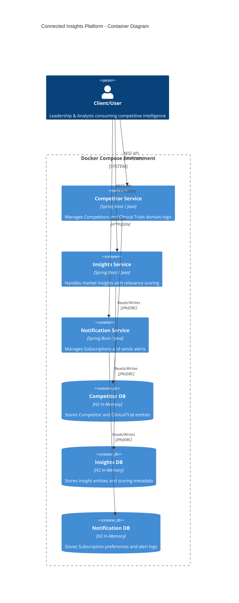

# Connected Insights Platform — Architecture Documentation

> **Version:** 1.0.0  
> **Last Updated:** February 2026  
> **Status:** MVP  
> **Author:** Enterprise AI Team, AstraZeneca

---

## Table of Contents

1. [System Overview](#1-system-overview)
2. [Service Boundaries & Responsibilities](#2-service-boundaries--responsibilities)
3. [Architecture Diagram](#3-architecture-diagram)
4. [Design Patterns & Architectural Choices](#4-design-patterns--architectural-choices)
5. [Data Storage Strategy](#5-data-storage-strategy)
6. [Authentication & Authorization](#6-authentication--authorization)
7. [API Contract Definitions](#7-api-contract-definitions)
8. [Future Considerations](#8-future-considerations)

---

## 1. System Overview

**Connected Insights** is a microservices-based platform developed for AstraZeneca's Enterprise AI team. The platform is designed to:

- **Aggregate** competitive intelligence data (Competitors, Clinical Trials, Market Insights)
- **Analyze** and score insights based on relevance and impact
- **Notify** leadership stakeholders of critical market developments

The system follows a distributed architecture with clear service boundaries, enabling independent development, deployment, and scaling of each component.

---

## 2. Service Boundaries & Responsibilities

The platform is decomposed into three core microservices, each encapsulating a distinct bounded context:

| Service | Responsibility | Location |
|---------|----------------|----------|
| **Competitor Service** | Manages domain logic for `Competitor` entities and their associated `ClinicalTrials`. Provides CRUD operations and query capabilities for competitive landscape data. | `/services/competitor-service` |
| **Insights Service** | Handles market `Insight` entities with automated relevance scoring based on `ImpactLevel` (HIGH, MEDIUM, LOW). Supports categorization by therapeutic area. | `/services/insights-service` |
| **Notification Service** | Manages user `Subscription` preferences and dispatches alerts when relevant insights are published. Currently implements log-based notifications for MVP. | `/services/notification-service` |

### Service Isolation Principle

Each service is:
- **Isolated** in its own directory under `/services/{service-name}`
- **Containerized** with its own `Dockerfile` for independent deployment
- **Self-contained** with dedicated database, configuration, and dependencies

---

## 3. Architecture Diagram

The following C4 Container diagram illustrates the high-level system architecture:



### Component Overview

```
┌─────────────────────────────────────────────────────────────────────────┐
│                        Docker Compose Network                            │
│  ┌─────────────────┐  ┌─────────────────┐  ┌─────────────────┐          │
│  │   Competitor    │  │    Insights     │  │  Notification   │          │
│  │    Service      │  │    Service      │  │    Service      │          │
│  │   (Port 8081)   │  │   (Port 8082)   │  │   (Port 8083)   │          │
│  └────────┬────────┘  └────────┬────────┘  └────────┬────────┘          │
│           │                    │                    │                    │
│  ┌────────▼────────┐  ┌────────▼────────┐  ┌────────▼────────┐          │
│  │   H2 Database   │  │   H2 Database   │  │   H2 Database   │          │
│  │   (Embedded)    │  │   (Embedded)    │  │   (Embedded)    │          │
│  └─────────────────┘  └─────────────────┘  └─────────────────┘          │
└─────────────────────────────────────────────────────────────────────────┘
```

---

## 4. Design Patterns & Architectural Choices

### 4.1 Hexagonal Architecture (Ports & Adapters)

Each microservice implements **Hexagonal Architecture** to achieve a clean separation of concerns:

```
┌─────────────────────────────────────────────────────────────┐
│                    Infrastructure Layer                      │
│  ┌──────────────┐  ┌──────────────┐  ┌──────────────┐       │
│  │  REST API    │  │  JPA/H2      │  │  External    │       │
│  │  Controllers │  │  Repositories│  │  Clients     │       │
│  │  (Adapters)  │  │  (Adapters)  │  │  (Adapters)  │       │
│  └──────┬───────┘  └──────┬───────┘  └──────┬───────┘       │
│         │                 │                 │                │
│  ┌──────▼─────────────────▼─────────────────▼──────┐        │
│  │              Application Layer                   │        │
│  │         (Use Cases / Port Interfaces)            │        │
│  └──────────────────────┬──────────────────────────┘        │
│                         │                                    │
│  ┌──────────────────────▼──────────────────────────┐        │
│  │               Domain Layer                       │        │
│  │     (Entities, Value Objects, Domain Logic)      │        │
│  └──────────────────────────────────────────────────┘        │
└─────────────────────────────────────────────────────────────┘
```

**Why Hexagonal Architecture?**

| Benefit | Description |
|---------|-------------|
| **Framework Independence** | Domain logic is decoupled from Spring Boot and JPA, making it portable and resilient to framework changes |
| **Testability** | Business rules can be unit-tested without Spring context, database, or HTTP layers |
| **Flexibility** | Infrastructure adapters (REST, JPA, messaging) can be swapped without modifying core logic |
| **Clean Boundaries** | Clear separation between "what the application does" (domain) and "how it connects to the world" (adapters) |

### 4.2 Database per Service

Each microservice maintains its **own dedicated database**, ensuring:

- **Loose Coupling:** No shared tables or direct database dependencies between services
- **Independent Deployability:** Schema changes in one service do not impact others
- **Technology Freedom:** Each service can choose its optimal persistence strategy

**Communication Pattern:** Services communicate exclusively via **REST APIs**—never through shared database access.

### 4.3 Synchronous vs. Asynchronous Communication

| Aspect | Current (MVP) | Future State |
|--------|---------------|--------------|
| **Communication Style** | Synchronous REST (HTTP/JSON) | Asynchronous Event-Driven |
| **Notification Delivery** | Log-based output | Message Queue (RabbitMQ/Kafka) |
| **Inter-Service Calls** | Direct HTTP requests | Event publishing/subscription |

**MVP Rationale:** Synchronous REST was chosen for initial development velocity and simplified debugging. The Hexagonal Architecture ensures that transitioning to asynchronous messaging (e.g., RabbitMQ for Notification events) requires only new adapter implementations—**zero changes to domain logic**.

---

## 5. Data Storage Strategy

### 5.1 Database Technology

| Environment | Technology | Rationale |
|-------------|------------|-----------|
| **Development / MVP** | H2 In-Memory Database | Rapid iteration, zero configuration, embedded testing support |
| **Production (Future)** | PostgreSQL / MySQL | ACID compliance, persistence, horizontal scalability |

### 5.2 Entity Schemas

#### Competitor Service

```
┌─────────────────────┐       ┌─────────────────────┐
│     Competitor      │       │    ClinicalTrial    │
├─────────────────────┤       ├─────────────────────┤
│ id (UUID) [PK]      │──┐    │ id (UUID) [PK]      │
│ name (String)       │  │    │ trialName (String)  │
│ industry (String)   │  │    │ phase (String)      │
│ headquarters (Str)  │  └───<│ competitorId [FK]   │
│ createdAt (Date)    │       │ status (String)     │
│ updatedAt (Date)    │       │ startDate (Date)    │
└─────────────────────┘       └─────────────────────┘
        (1)          One-to-Many          (N)
```

#### Insights Service

```
┌─────────────────────────────┐
│           Insight           │
├─────────────────────────────┤
│ id (UUID) [PK]              │
│ description (String)        │
│ therapeuticArea (String)    │
│ competitorId (UUID)         │
│ impactLevel (Enum)          │  ← HIGH(9), MEDIUM(6), LOW(3)
│ relevanceScore (Integer)    │  ← Calculated from ImpactLevel
│ createdAt (Date)            │
└─────────────────────────────┘
```

#### Notification Service

```
┌─────────────────────────────┐
│        Subscription         │
├─────────────────────────────┤
│ id (UUID) [PK]              │
│ userId (UUID)               │
│ therapeuticArea (String)    │
│ minImpactLevel (Enum)       │
│ active (Boolean)            │
│ createdAt (Date)            │
└─────────────────────────────┘
```

---

## 6. Authentication & Authorization

### 6.1 Current State (MVP)

For this MVP release, the following security posture applies:

| Aspect | Implementation |
|--------|----------------|
| **External Access** | Open (no authentication required) |
| **Service-to-Service** | Open within Docker network |
| **Network Boundary** | Docker Compose internal network provides isolation |

> ⚠️ **Note:** This configuration is suitable for development and demonstration purposes only.

### 6.2 Future State (Production)

The production security architecture will implement:

```
┌──────────────┐     ┌─────────────────┐     ┌────────────────────┐
│    Client    │────▶│   API Gateway   │────▶│   Microservices    │
│              │     │   + JWT Auth    │     │                    │
└──────────────┘     └─────────────────┘     └────────────────────┘
                            │
                     ┌──────▼──────┐
                     │   Identity  │
                     │   Provider  │
                     │  (OAuth2)   │
                     └─────────────┘
```

| Component | Technology | Purpose |
|-----------|------------|---------|
| **API Gateway** | Spring Cloud Gateway / Kong | Single entry point, rate limiting, routing |
| **Authentication** | JWT (JSON Web Tokens) | Stateless user authentication |
| **Authorization** | RBAC (Role-Based Access Control) | Resource-level permissions |
| **Service Mesh** | Istio / Linkerd *(optional)* | mTLS for internal service communication |

---

## 7. API Contract Definitions

### 7.1 Resource Summary

| Service | Base Path | Primary Resources | Operations |
|---------|-----------|-------------------|------------|
| **Competitor Service** | `/api/v1/competitors` | Competitors, Clinical Trials | CRUD, Search |
| **Insights Service** | `/api/v1/insights` | Insights | CRUD, Filter by Impact |
| **Notification Service** | `/api/v1/subscriptions` | Subscriptions | CRUD, Trigger Alerts |

### 7.2 Sample Endpoints

```
# Competitor Service
GET    /api/v1/competitors
POST   /api/v1/competitors
GET    /api/v1/competitors/{id}
GET    /api/v1/competitors/{id}/trials

# Insights Service
GET    /api/v1/insights
POST   /api/v1/insights
GET    /api/v1/insights/{id}
GET    /api/v1/insights?impactLevel=HIGH

# Notification Service
GET    /api/v1/subscriptions
POST   /api/v1/subscriptions
DELETE /api/v1/subscriptions/{id}
```

---

## 8. Future Considerations

| Area | Current State | Future Enhancement |
|------|---------------|-------------------|
| **Messaging** | Synchronous REST | RabbitMQ / Apache Kafka for event-driven notifications |
| **Database** | H2 In-Memory | PostgreSQL with connection pooling |
| **Caching** | None | Redis for frequently accessed data |
| **Observability** | Basic logging | Distributed tracing (Jaeger), Metrics (Prometheus/Grafana) |
| **Security** | Open access | API Gateway + JWT + OAuth2 |
| **Deployment** | Docker Compose | Kubernetes (EKS/AKS) |

---

## References

- [API Documentation](./API.md)
- [Docker Compose Configuration](./docker-compose.yml)

### Service Documentation

- [Competitor Service README](./services/competitor-service/README.md)
- [Insights Service README](./services/insights-service/README.md)
- [Notification Service README](./services/notification-service/README.md)
