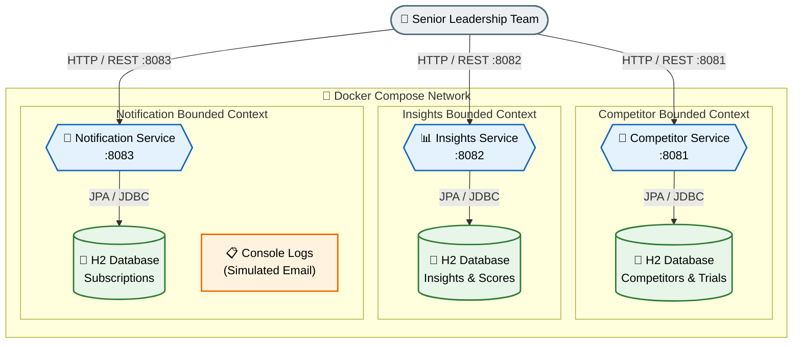

# Connected Insights Platform — Architecture Diagram

> **Version:** 1.0.0
> **Author:** Jorge Falcigno

---

## System Architecture Overview

The following diagram illustrates the high-level architecture of the Connected Insights platform, showing the microservices, their databases, and communication patterns.

---

## Diagram Legend

| Symbol | Meaning |
|--------|---------|
| 🔷 **Blue Hexagon** | Spring Boot Microservice |
| 🟢 **Green Cylinder** | H2 In-Memory Database |
| ⬜ **Gray Stadium** | External Actor (User) |
| 🟠 **Orange Rectangle** | Output / Logs |
| **Solid Arrow (→)** | Synchronous Communication |
| **Dashed Arrow (⇢)** | Optional / Future Integration |

---

## Port Mapping

| Service | Internal Port | External Port | Description |
|---------|---------------|---------------|-------------|
| Competitor Service | 8080 | **8081** | Manages Competitors & Clinical Trials |
| Insights Service | 8080 | **8082** | Handles Market Insights with Scoring |
| Notification Service | 8080 | **8083** | Manages Subscriptions & Alerts |

---

## Communication Patterns

### Current State (MVP)
- **Client → Services:** RESTful HTTP/JSON over exposed ports
- **Services → Databases:** JPA/JDBC (embedded H2)
- **Notification Output:** Console logging (simulated email)

### Future State
- **Event-Driven:** RabbitMQ/Kafka for async notifications
- **Service Mesh:** Istio for mTLS and observability
- **API Gateway:** Centralized authentication and routing

---

## References

- [Full Architecture Documentation](./ARCHITECTURE.md)
- [API Specifications](./API.md)
- [Project README](./README.md)
